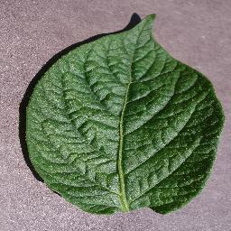
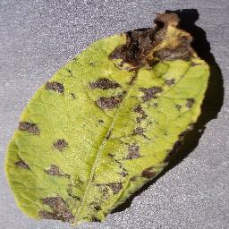

# Autonomous Potato leaf disease detection using Machine Learning appraoch

## Introduction
During some months of the year the potato plants suffer from some leaf diseases, known as *Blights*. These are formed and can be classified as two-staged disease:
- **Early blight** : Early blight of potato is caused by the fungal pathogen Alternaria solani. The disease affects leaves, stems and tubers and can reduce yield, tuber size, storability of tubers, quality of fresh-market and processing tubers and marketability of the crop.
In most production areas, early blight occurs annually to some degree. The severity of early blight is dependent upon the frequency of foliar wetness from rain, dew, or irrigation; the nutritional status of the foliage; and cultivar susceptibility.
- **Late blight** : Late blight is caused by the funguslike oomycete pathogen Phytophthora infestans. This potentially devastating disease can infect potato foliage and tubers at any stage of crop development. The primary host is potato, but P. infestans also can infect other solanaceous plants, including tomatoes, petunias and hairy nightshade, that can act as source of inoculum to potato.

## Comparison of Normal leaf VS Early blight VS Late blight
| Normal             |  Leaf with Early blight | Leaf with Late blight |
:-------------------------:|:-------------------------:|:-------------------------:
  |   | 
